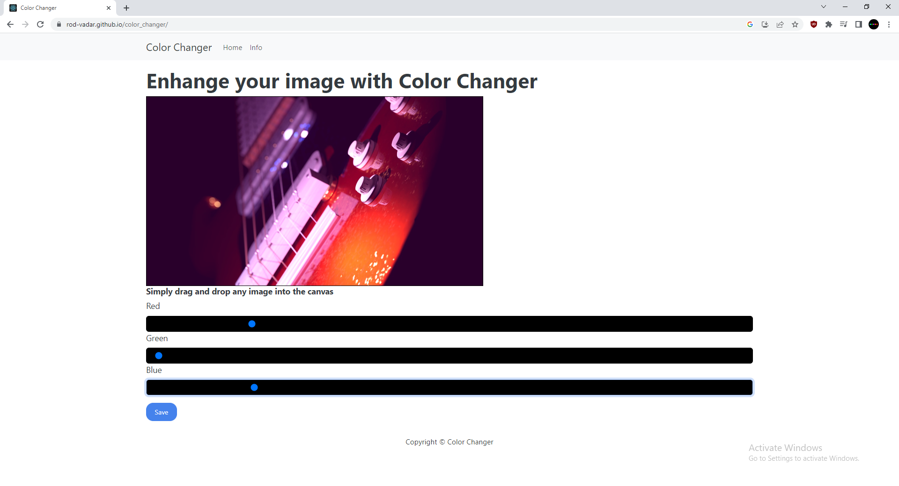

# Color Changer is a small example app made with React that allows the user to drop a photo on to the interface and then change the rbg values with sliders

## The live site is [Color Changer](https://rod-vadar.github.io/color_changer/)

##
